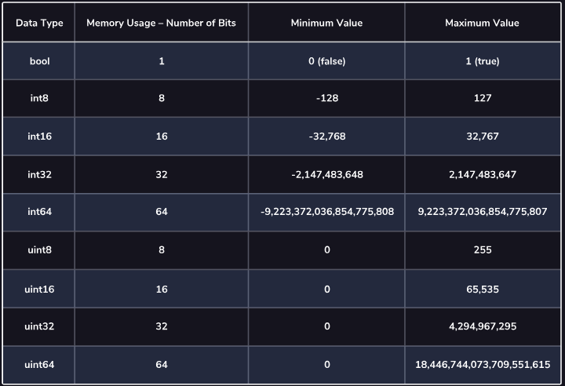

# Go Notes

## Learn Go - Introduction

### From The Get Go
* Developed by Google
* Sits between low-level & high-level
* Produces code that runs fast and uses **little memory**
    * Has **garbage collection**
* Some **object oriented** features

### Compiling Files
* To make a `.go` file into an executable we need to compile it via the `go build` command
    * E.g. `go build greet.go`
    * After this by doing an `ls` in the directory we can now see that we have an executable called `greet`
```bash
ls
greet     greet.go
```
* This can be executed via `./greet`

### Running Files
* We can directly run a file instead of the two step process shown above of compilation and then running
    * The `go run` command compiles the code and then runs it
    * But an executable **won't** be created in our directory
    * E.g. `go run greet.go`
* Useful for quick testing of code

### Packages
* Projects can have multiple `.go` files organised into **packages**
  * Essentially like a directory
  * E.g. calculator program would have calculation `.go` files in `calc` package
    *  I/O related go files in `io` package
* Simple example
  * 1st line below `package main` tells compiler **which package** file belongs to
    * It is **package declaration**
    * Specifying `package main` ensures program compiles into **executable**
  * 2nd line of code imports function from another package via `import` command
    * Notice that package name is in **quotes**
    * 
```go
package main 

import "fmt" 

func main () {
  fmt.Println("Hello World") 
}

```
### Main Function
* To define a function in Go use the `func` keyword
  * Followed by name of function E.g. main
  * After this we need a set of parentheses i.e. `()`
  * Any code inside the function needs to be within set of **curly braces** i.e. {}
    * Also needs to be **indented**
  * E.g.
```
func main () {
    fmt.Println("Hello World") 
}
```
* Having a main function inside `main.go` is special to Go
  * Created executable when compiled
  * Also starts executing code in here as starting point
    * Same as python
* Defining a function doesn't call it
  * Same as python

### Importing Multiple Packages
* There are two main ways to import multiple palcage
  * USe multiple import statements
  * Or use single statement with **parentheses**
    * E.g.
```go
import (
  "package1"
  "package2"
)
```
* We can also give a package an alias
  * Then refer to this instead inside code
  * As we do in python using `as` keyword
  * E.g.
```go
import (
  p1 "package1"
  "package2"
)
```

### Comments
* There are two different types of comment in Go
  * Single-line using `//`
    * E.g.
```go
// This entire line is ignored by the compiler
// fmt.Println("Does NOT print")
fmt.Println("This gets printed!") // This part gets ignored
```
  * Block comments a.k.a multi-line using `/* */`
    * E.g.
```go
/*
This is ignored.
This is also ignored. 
fmt.Println("This WON'T print!")
*/
```

### Go Resources
* Golang includes **go doc** tool for viewing documentation about packages and their functions
  * E.g.
```go
$ go doc fmt.Println
package fmt // import "fmt"

func Println(a ...interface{}) (n int, err error)
    Println formats using the default formats for its operands and writes to
    standard output. Spaces are always added between operands and a newline is
    appended. It returns the number of bytes written and any write error
    encountered.
```
## Learn Go - Variables & Types
### Literals
* Literals a.k.a values can be anything from number or text
  * Essentially unnamed things
    * i.e. not assigned to variables
* We can do normal arithmetic on integer literals
  * Or add strings together
  * **But we can't multiply string and int like we can in python**
    * i.e. print string x no. of times

### Constants
* One type of named values
* Can't be updated while program running
  * Helps conveys intent of keeping consistent value
* We use `const` keyword to create constant
* E.g.
```go
const funFact = "Hummingbirds' wings can beat up to 200 times a second."

fmt.Println("Did you know?")
fmt.Println(funFact)
```
* We must use **camelCase** or **PascalCase** for constants

### Data Types
* Programming languages like Go store data as binary numbers in memory
* Go has **3 basic data types** for **numbers**
  1. **Integers** - `int`
     * Can be positive or negative
     * E.g. `22` and `-1500`
  2. **Floating-point** - `float`
     * Numbers with a decimal point
     * Can also be positive or negative
     * E.g. `1458.2` and `-1900.001`
  3. **Complex Numbers** - `complex`
     * Can also be +ve or -ve
     * Used in 2D coordinates or calculation include sq roots
     * E.g. `3i` and `-14 - -.05i`

### Basic Numeric Types in Go
* There are 15 ways to describe a number in Go
  * 2 types for floating-point
  * 11 types for integer
  * 2 types for complex 
* The different types dictate **how much memory** number takes to store
  * As well as **how many binary digits** it uses to store it
    * Less bits means fewer possible values i.e. min/max values
  * Better to use types with **smaller range** if possible
* Integers can be **signed** or **unsigned**
  * Unsigned can **only be positive**
    * Minimum value is 0
  * Signed can be either -ve or +ve
    * Max value lower than unsigned for same no. of bits vs unsigned
* Boolean type only uses **1 bit**
* Numeric Data Types Table



* Floats and complex no. **don't** have max. or min. numbers
* Floats can be `float32` or `float64`
  * Difference is how much data used to **ensure value's precision**

### What is a Variable
* Variables in Go are defined using **var keyword**
  * They also need their **type defined**
  * E.g. `var neighbourUp bool`
* Should also be in **camelCase**
* Other examples
  * `var lengthOfSong uint16` - Unsigned 16-bit integer
  * `var songRating float32` - 32-bit float

### Reading Go Errors
* When Go compiler raises error code cannot be turned into binary
  * Thus code can't be run
* An example of an error is when we define variable but **don't use it**
  * E.g. `./main.go:4:7: numberWheels declared and not used`
    * Unused variables are waste of space

### Assigning Variables
* After defining a variable we can assign it a value
  * E.g. 
```go
var ipAddress
ipAddress = "192.168.1.2"
```
* We could also **define** and **assign** a value in one line
  * E.g. `var kilometersToMars int32 = 62100000`
* **Strings can't have single quotes**
  * USed for specific character called rune

### Zero Values
* Variables of different types have **default values**
  * i.e. String defaults to "", int to 0 and boolean to false
  * E.g.
```go
var classTime uint32
var averageGrade float32
var teacherName string
var isPassFail bool

fmt.Println(classTime) // Prints 0
fmt.Println(averageGrade) // Prints 0
fmt.Println(teacherName) // Doesn't print anything
fmt.Println(isPassFail) // Prints false
```

### Inferring Values
* In Go we **don't** have to **specify variable type** if we use `:=` operator
  * Called short decleration operator
  * We can use this if we know what variable should hold when creating it
* E.g.
```
nuclearMeltdownOccurring := true
radiumInGroundWater := 4.521 //Type float64
daysSinceLastWorkplaceCatastrophe := 0 //Type int32/int64
externalMessage := "Everything is normal. Keep calm and carry on."
```
* Notice we don't need to use `var` keyword 
* The long way to do the above is:
```
var nuclearMeltdownOccurring = true
var radiumInGroundWater = 4.521
var daysSinceLastWorkplaceCatastrophe = 0
var externalMessage = "Everything is normal. Keep calm and carry on."
```

### Default int Type
* We can assign an integer `uint` or `int` type
* If computer architecture is 32-bit it will use int32/uint32
  * If 64-bit then int64/uint64
* Usually recommended to use either `uint` or `int`
  * Instead of specifying no. of bits
  * E.g.
```
var timesWeWereFooled int
var foolishGamesPlayed uint
```
* When we use **value inferring** with integers it defaults to `int`
  * E.g. `consolationPrizes := 2`

### Updating Variables
* As with Python we can update variables in Go
  * In below e.g. `basketTotal` var defaults to 0
    * Wouldn't be the case in Python
```
var basketTotal float64
carrotPrice := 0.75

basketTotal = basketTotal + carrotPrice
fmt.Println(basketTotal) // Prints: 0.75
```
* Same as Python we can also use `+=` above instead
  * Also works on strings
  * Others operators are: `*=`, `/=` and `-=`

### Multiple Variable Declaration
* We can declare multiple variables in **single line**
  * E.g.
```
var part1, part2 string
part1 = "To be..."
part2 = "Not to be..."
```
* Same goes for inferring also 
  * E.g. `quote, fact := "Bears, Beets, Battlestar Galactica", true`

## Learn Go: FMT Package

### The fmt Package
* fmt is one of Go's **core packages**
  * Also has utilities that help us **format** data
    * Apart from printing things
* Other supported methods
  * `fmt.Print()`
  * `fmt.Printf()`
  * The below format but doesn't print anything to the console
  * `fmt.Sprint()`
  * `fmt.Sprintln()`
  * `fmt.Sprintf()`
  * To get user input
    * * `fmt.Scan()`

### The Print Method
* The `fmt.Println()` method does some formatting for us by default
  * It adds a **space** to the arguments inside it and adds **line break** at the end
* Sometimes we may not want this behaviour
  * i.e don't want the extra space or the line break
* E.g.
```
fmt.Print("The answer is", ": ")
fmt.Print("12")
// Prints: The answer is: 12
```

### The Printf Method
* The `fmt.Printf()` method allows us to do **string interpolation**
  * Like f-strings
* Example
  * `%v` part is called **verb**
    * Specific letter after `%` tells it what exactly to put in placeholder
```
selection1 := "soup"
selection2 := "salad"
fmt.Printf("Do I want %v or %v?", selection1, selection2)
// Prints: Do I want soup or salad?
```

### Different Verbs
* Another verb is `%T` which prints out **type** of 2nd argument
  * E.g.
```
specialNum := 42
fmt.Printf("This value's type is %T.", specialNum)
// Prints: This value's type is int.

quote := "To do or not to do"
fmt.Printf("This value's type is %T.", quote)
// Prints: This value's type is string.
```
* The `%d` verb prints out a number in string format
  * E.g.
```
votingAge := 18
fmt.Printf("You must be %d years old to vote.", votingAge)
// Prints: You must be 18 years old to vote. 
```
* The `%f` verb to print out a float in string format
  * E.g.
```
gpa := 3.8
fmt.Printf("You're averaging: %f.", gpa)
// Prints: You're averaging 3.800000.
```
* We can also control **number of decimals** in float
  * E.g.
```
gpa := 3.8
fmt.Printf("You're averaging: %.2f.", gpa)
// Prints: You're averaging 3.80.
```
  
### Sprint and Sprintln
* These methods allow us to format strings **without printing** them
  * E.g.
```
grade := "100"
compliment := "Great job!"
teacherSays := fmt.Sprint("You scored a ", grade, " on the test! ", compliment)

fmt.Print(teacherSays)
// Prints: You scored a 100 on the test! Great job!
```
* As before `Sprintln` adds spacing and a new line
  * E.g.
```
quote = fmt.Sprintln("Look ma,", "no spaces!")
fmt.Print(quote) // Prints Look ma, no spaces!
```

### Sprintf Method
* Method a bit like using python f-string without print statement
  * Let's us do interpolation
* Uses same verbs as Printf
```
correctAns := "A"
answer := fmt.Sprintf("And the correct answer is… %v!", correctAns)

fmt.Print(answer) // Prints: And the correct answer is… A!
```

### Getting User Input
* We can use the `fmt.Scan` method to get input from user
  * E.g. below would take in single word from user
    * If we entered 2 words separated by space only 1st one taken
```
fmt.Println("How are you doing?") 

var response string 
fmt.Scan(&response)

fmt.Printf("I'm %v.", response) 
```
* Below example takes 2 arguments i.e. 2 words
```
fmt.Println("How are you doing?") 

var response1 string 
var response2 string 
fmt.Scan(&response1)
fmt.Scan(&response2)

fmt.Printf("I'm %v %v", response1, response2)
```
* The `&` character used references **addresses** as `fmt.Scan()` expects these
  * Without it the program will not actually ask for any input

## Conditionals

### If Statement
* Our condition can be within parenthesis but not mandatory
* Code to be executed if condition is true needs to be within **curly braces**
  * No colon needed like Python
* Booleans in Go are **all lowercase**. E.g. `true`
* E.g.
```
alarmRinging := true
if alarmRinging {
  fmt.Println("Turn off the alarm!!") 
}
```

### The Else Statement
* Else block will also need to have it's code in curly braces
  * E.g.
```
isHungry := false
if isHungry {
  fmt.Println("Eat the cookie") 
} else {
  fmt.Println("Step away from the cookie...")
}
```

### Comparison Operators
* Comparison operators work in the exact same way as Python

### Logical Operators
* Different to Python
  * Not is `!`
  * And is `&&`
  * Or is `||`
* E.g.
```
if storeLights == "on" && doorsOpen {
  fmt.Println("You can enter the store!")
} 
```

### Not Operator
* Essentially reverses value of a boolean
  * E.g.
```
bored := true
fmt.Println(!bored) // Prints false

tired := false;
fmt.Println(!tired) // Prints true
```
* We can also add them to if statements
  * E.g.
```
if !readyToGo {
		fmt.Println("Start the car!")
}
```

### Else if Statement
* Instead of elif in Python in Go we use `else if`
  * E.g.
```
position := 2

if position == 1 {
  fmt.Println("You won the gold!")
} else if position == 2 {
  fmt.Println("You got the silver medal.")
} else if position == 3 {
  fmt.Println("Great job on bronze.")
} else {
  fmt.Println("Sorry, better luck next time?")
}
```

### Switch Statement
* Instead of the verbosity of writing multiple else if statements we can use `switch` and `match`
* `switch` is followed by **variable** the conditional is looking at 
* `case` is followed by **value** it should be equal to and colon
  * Then code that should be run for condition is **indented below**
  * Can also use comparsion operators
* Finally the `default` keyword is used at the end like an **else**
* E.g.
  * Using else if
```
clothingChoice := "sweater"

if clothingChoice == "shirt" {
  fmt.Println("We have shirts in S and M only.")
} else if clothingChoice == "polos" {
  fmt.Println("We have polos in M, L, and XL.")
} else if clothingChoice == "sweater" {
  fmt.Println("We have sweaters in S, M, L, and XL.")
} else {
  fmt.Println("Sorry, we don't carry that.")
}
```
* Same example now using switch
```
clothingChoice := "sweater"

switch clothingChoice {
case "shirt":
  fmt.Println("We have shirts in S and M only.")
case "polos":
  fmt.Println("We have polos in M, L, and XL.")
case "sweater":
  fmt.Println("We have sweaters in S, M, L, and XL.")
case "jackets":
  fmt.Println("We have jackets in all sizes.")
default:
  fmt.Println("Sorry, we don't carry that")
}
// Prints: We have sweaters in S, M, L, and XL.
```

### Scoped Short Decleration Statement
* We can **declare variables** within an if or switch statement
  * Done using `:=` straight after `if` keyword
  * But before the comparison
  * Separated by `;`
  * E.g.
```
x := 8
y := 9
if product := x * y; product > 60 {
  fmt.Println(product, "  is greater than 60")
}
```
* E.g. below shows how to do it within switch statement
```
switch season := "summer" ; season {
case "summer":
  fmt.Println("Go out and enjoy the sun!")
}
```
* **Variable defined like this are only valid within the block**
  * i.e. Trying to use these after outside of the block will throw an error

### Randomising
* Go has a `math/rand` library which can generate random numbers for us
  * E.g. of usage
    * below should print a random number from 0 to 99 but it will always print 81
```
import (
  "math/rand"
  "fmt"
)

func main() {
  fmt.Println(rand.Intn(100))
}
```

### Seeding
* The reason the above code did not give us random number was due to how Go **chooses starting no.**
  * i.e. starting point for generating random number  
  * Known as seed number which defaults to 1
* To actually get random number we need to pass in **unique seed number**
  * To get seed no. we use `rand.Seed()` method
  * One way to do this is to use the **time** via `time` library
    * As it's always different
    * E.g.
```
package main

import (
  "fmt"
  "math/rand"
  "time"
)

func main() {
  // Gives us time difference since 1 Jan 1970 UTC in us thus different seed no.
  rand.Seed(time.Now().UnixNano())
  fmt.Println(rand.Intn(100))
}
```
* Essentially this line will give us random number: `rand.seed(time.Now().UnixNano())`

## Functions

### What is a function
* In Go we use `func` keyword to define a function
  * Type hints are **mandatory** unlike python
  * E.g. below shows function with input and output being ints 
    * Code also needs to be in curly braces
```
func doubleNum(num int) int {
  return num * 2
}
```
* `main` function **doesn't** have to be called as compiler already knows to do it
  * Unlike Python
* A function is called in the exact same way as python
  * E.g. `fmt.Println(doubleNum(x)) // Prints: 10`

### Scope
* There are 3 scopes for variables inside Go as with Python
  * Global
  * Within function
  * Within main function

### Returning Values from Functions
* Works in similar way to Python

### Using Function Parameters
* As with python we can call a function with some arguments
  * Then these parameters are used within the function
* If multiple parameters have the **same type** we don't need to specify each time
  * E.g.
```
func multiplier(x, y int32) int32 {
  return x * y
}
```

### Returning Multiple Values
* As in Python we can also return multiple values in a function
  * We can then unpack them in exactly the same way also
    * As well as being able to use special variable `_`
  * E.g.
```
package main

import "fmt"

func getLengthOfCentralPark() (int32, string) {
	var lengthInBlocks int32
	lengthInBlocks = 51
	unit := "m"
	return lengthInBlocks, unit
}

func main() {
	len, unit := getLengthOfCentralPark()
	fmt.Print(len, unit)
}
```
### Deferring Resolution
* We can use the `defer` keyword to do something at the end of a function call
  * Usually call another function
* Useful if we have **multiple return statements** in code
  * As any code aftrer a return statement is not run
* Feature can be used logging and writing to file etc.
  * Or doing things like disconnecting from DB aftrer we run a query
* Typically added at the top of a function definition
* E.g.
```
func calculateTaxes(revenue, deductions, credits float64) float64 {
  defer fmt.Println("Taxes Calculated!")
  taxRate := .06143
  fmt.Println("Calculating Taxes")

  if deductions == 0 || credits == 0 {
    return revenue * taxRate
  }
  

  taxValue := (revenue - (deductions * credits)) * taxRate
  if taxValue >= 0 {
    return taxValue
  } else {
    return 0
  }
}

// Output
Calculating Taxes
Taxes Calculated!
```

## Addresses & Pointers

### The Point of Pointers and Addresses
* Go is **pass-by-value** language
  * Functions are passed **value** of argument
    * Not argument itself
    * Means changes that happen in function stay within function
* Analogy of a teacher with a worksheet
  * She has original copy but hands copies to students
  * Student's don't write/change the original
* We can change values from **different scopes** using below:
  * Addresses
  * Pointers
  * Dereferencing

### Addresses
* When we declare a variable in Go the computer sets aside **space in memory** to store value
  * Called **address** and is **unique** numerical value
* When we **use variable** we get **value stored at address**
  * Use the `&` operator to print variable' address
    * Followed by name of variable
    * Gives us value in Hex
```
x := "My very first address"
fmt.Println(&x) // Prints 0x414020
```

### Pointers
* Pointers are **variables** that **store addresses**
  * `*` operator used to signify variable stores address
  * E.g. `var pointerForInt *int`
    * We specify address of variable is holding an `int`
* Full example
```
var pointerForInt *int

minutes := 525600

pointerForInt = &minutes

fmt.Println(pointerForInt) // Prints 0xc000018038
```
* Another way we can declare a pointer is via inferring
  * E.g.
```
minutes := 55

pointerForInt := &minutes
```

### Dereferencing
* We can use this if we want **address** to store **different value**
  * i.e. change what's stored there
* A.k.a indirecting
* We still need to use `*` operator
  * E.g.
```
lyrics := "Moments so dear" 
pointerForStr := &lyrics
// use dereferencing to point to address in memory and assign new value
*pointerForStr = "Journeys to plan" 

fmt.Println(lyrics) // Prints: Journeys to plan
```

### Changing Values in Different Scopes
* In Go when we call function with value as input we don't pass actual address of variable
  * But just it's value
* We have below e.g. where x does not change
```
func addHundred(num int) {
  num += 100
}

func main() {
  x := 1
  addHundred(x)
  fmt.Println(x) // Prints 1
}
```
* To make sure x changes we would have to do this
  * `addHundred` func now takes in pointer as parameter
  * We then reference it and give it new value in memory address
  * In `main` func we also need to give pointer using address via `&` operator
```
func addHundred (numPtr *int) {
  *numPtr += 100
}

func main() {
  x := 1
  addHundred(&x)
  fmt.Println(x) // Prints 101
}
```

## Loops

### Classic For Loop
* A for loop in Go has **3 components**
  * 1st part is where we define **starting value** for loop variable
  * 2nd is the **condition** that needs to be true
  * 3rd is what to do **after each iteration**
    * i.e. increment loop variable
* E.g.
```
for number := 0; number < 5; number++ {
  fmt.Print(number, " ")
}
// Output: 0 1 2 3 4
```
* For loop in Go is unlike for loop in Python

### For as a While Loop
* Sometimes we don't know how many iterations of loop we need
  * Here we use **indefinite loops**
    * Repeat whilst condition is true
* Go uses `for` statement for these types of loop too
  * But there are 2 main differences
    1. Loop variable needs to defined **outside of block**
    2. Update to loop variable after each iteration needs to be within block
       * Unlike in definite loop
* E.g.
  * Output of below and above example are the same
```
number := 0 // Initialize a variable to be used inside the loop
for number < 5 {
  fmt.Println(number)
  number++ // Update the variable being used
}
```

### Infinite Loop
* These are usually dangerous but can also be useful
  * In case of something like web server that needs to run always
    * But we can break out of the loop
* E.g.
```
for {
  // Loop body logic
  // This repeats forever
}
// This is never reached
```

### Break and Continue
* As with python we can use these two keywords to break out of a loop
  * Or current iteration
* Example of `break` keyword
```
// Init slice of strings - dynamically sized flexible view into array elements
animals := []string{"Cat", "Dog", "Fish", "Turtle"}
for index := 0; index < len(animals); index++ {
  if animals[index] == "Dog" {
    fmt.Println("Found the perfect animal!")
    break // Stop searching the array
  }
}
```
* Example of `continue` keyword
```
jellybeans := []string{"green", "blue", "yellow", "red", "green", "yellow", "red"}
for index := 0; index < len(jellybeans); index++ {
  if jellybeans[index] == "green" {
    continue
  }
  fmt.Println("You ate the", jellybeans[index], "jellybean!")
}
```

### Looping and Arrays
* We can use the `range` keyword with maps and arrays
  * To loop through their elements
  * E.g. below shows usage
    * `range letters` gives us 2 things back always
      * array index and actual element
      * So below syntax needed
```
letters := []string{"A", "B", "C", "D"}
for index, value := range letters {
  fmt.Println("Index:", index, "Value:", value)
}
```
* Output:
```
Index: 0 Value: A
Index: 1 Value: B
Index: 2 Value: C
Index: 3 Value: D
```
* For maps the syntax is the same but range gives `key, value` instead
  * E.g.
```
addressBook := map[string]string{
  "John": "12 Main St",
  "Janet": "56 Pleasant St",
  "Jordan": "88 Liberty Ln",
}
for key, value := range addressBook {
  fmt.Println("Name:", key, "Address:", value)
}
```
* Output:
```
Name: John Address: 12 Main St
Name: Janet Address: 56 Pleasant St
Name: Jordan Address: 88 Liberty Ln
```

## Arrays & Slices

### Intro to Arrays
* **Fixed size** collection of data elements **of same type**
  * Unlike python where they can be mixed and variable size
  * We can still use indexing to access them

### Array Creation
* Before using an array we need to **declare** and **name** it
* When a variable is declared in Go compilor **finds space** in **memory** for it
  * Associates name with variable too
  * Issue is that compilor needs to find enough space for several occurances of data type
  * Thus we need to **provide no. of elements**
* Once declared the no. of elements **can't be changed**
  * Workaround is to **declare new array**
* Array's can be created with inital set of elements
  * But not mandatory
  * E.g. below defines empty array with 4 elements of type `int`
```
var playerScores [4]int
fmt.Println(playerScores)
// [0 0 0 0]
```

### Array Creation with Elements
* To give an array elements at creation we need to use square brackets {}
  * E.g. `triangleSides := [3]int{15, 26, 30}`
* We could also make the compiler **dynamically determine array length**
  * Using ellipsis syntax i.e. `...`
  * E.g. `triangleAngles := [...]int{30, 60, 90}`


### Access Array Values with Indices
* As with Python we can access individual elements via it's index
  * But unlike Python we can't use a negative index
    * Workaround is to use `length := len()` and use `length-1` index
      * E.g. `fmt.Println("Last", slice[length-1])`
      * Or `slice[len(slice)-1] = newName`
```
students = [3]string{"Jill", "Fred", "Sasha"}
// Access the first element of the array
fmt.Println(students[0])
// Output: Jill
// Access the third element of the array
fmt.Println(students[2])
// Output: Sasha
// Store the second element into a variable
secondStudent := students[1]
// Print it
fmt.Println(secondStudent)
// Output: Fred
```

### Modifying Array Values
* As with Python we can change array values via index
  * E.g.
```
myArray := [4]int{10, 24, 5, 47}
myArray[2] = 33
```

### Intro to Slices
* Slices are similar type to arrays but **can change size**
* There are different ways to create slices
  * E.g.
```
// Each of the following creates an empty slice
var numberSlice []int
stringSlice := []string{}

// The following creates a slice with elements
names := []string{"Kathryn", "Martin", "Sasha", "Steven"}
```
* We can also create a slice based on existing array
* **Updating an element in a slice also updates the original array**
* E.g.
```
array := [5]int{2, 5, 7, 1, 3}
// This is a slice of the whole array
sliceVersion := array[:]
fmt.Println(sliceVersion)
// prints
// [2 5 7 1 3]

// Change slide element
sliceVersion[1] = 6
fmt.Println(array)
// prints - original array also changed
// [2 6 7 1 3]
```
* As with python we can use slicing to get **sub-set** of array
  * E.g.
```
partialSlice := array[2:5]
fmt.Println(partialSlice)
// [7 1 3]
```
* Unlike arrays we **don't** need to **specify no. of elements**
* We can access elements normally via indexes
  * E.g.
```
var names = []string{"Kathryn", "Martin", "Sasha", "Steven"}
fmt.Println(names[1])
// Martin
names[3] = "Bishop"
fmt.Println(names[3])
// Bishop
```

### Length and Capacity
* As with python we can use the `len()` function get the length of array/slice
  * E.g.
```
favoriteThings := [2]string{"Raindrops on Roses", "Whiskers on Kittens"}
fmt.Println(len(favoriteThings))
// 2
```
* Slices also have concept of **capacity** as they are re-sizable
  * Defines as max no. of elements it can hold before **needing to re-size**
  * We use `cap()` function to figure out capacity
  * E.g. below shows how capacity of slice doubles when we try to append element to it
    * Slice is already at **full capacity**
```
slice := []string{"Fido", "Fifi", "FruFru"}
// The slice begins at length 3 and capacity 3
fmt.Println(slice, len(slice), cap(slice))
// [Fido Fifi FruFru] 3 3
slice = append(slice, "FroFro")
// After appending an element when the slice is at capacity
// The slice will double in capacity, but increase its length by 1
fmt.Println(slice, len(slice), cap(slice))
// [Fido Fifi FruFru FroFro] 4 6
```
* **Slices can still have elements added if they are at full capacity**

### Append to Slices
* We can use the `append()` function to add elements to slices
  * Syntax is slice name then element to add
  * We need to **re-assign** slice for it to work
  * Slice re-sizes automatically
  * E.g.
```
books := []string{"Tom Sawyer", "Of Mice and Men"}
books = append(books, "Frankenstein")
books = append(books, "Dracula")
fmt.Println(books)

```

### Arrays and Slices in Functions
* To pass in an array into a function as parameter we give the name, [] with no. of elements and element data type
  * For slices we don't need no. of elements just []
  * E.g.
```go
func printFirstLastArray(array [4]int) {
    fmt.Println("First", array[0])
    fmt.Println("Last", array[3])
}

func printFirstLastSlice(slice []int) {
    length := len(slice)
    if (length > 0) {
        fmt.Println("First", slice[0])
        fmt.Println("Last", slice[length-1])
    }
}
```
* Modifying an array parameter only does so **locally within function**
  * As Go in pass-by-value language
  
  * E.g.
```go
// Changes to the array will only be local to the function
func changeFirst(array [4]int, value int) {
    array[0] = value
}
```
  * Other option is to return the array within function
* If we want to retain changes made use a slice
  * E.g.
```go
// Changes to the slice parameter will be permanent
func changeFirst(slice []int, value int) {
    if (len(slice) > 0) {
        slice[0] = value
    }
}
```
* **Slices act as pointers**

## Go Maps

### Intro to Maps
* Essentially a python dictionary
  * But we need to specify **type** of key and value
* Syntax is `map`[key_type]value_type
  * E.g.
```go
package main
import "fmt"

func main() {
	// Create a simple contact list.
	contacts := map[string]int{
		"Joe":    2126778723,
		"Angela": 4089978763,
		"Shawn":  3143776876,
		"Terell": 5026754531,
	}
	// Print out all the contacts
	fmt.Println(contacts)
}
// Prints: map[Angela:4089978763 Joe:2126778723 Shawn:3143776876 Terell:5026754531]
```
* We access value's the same way we do in python

### Map Creation
* To create an **empty map** we can use the `make()` function
  * Passing in map definition
  * E.g. `prices := make(map[string]float32)`
* To create a map with values already we don't need to use `make()`
```go
contacts := map[string]int{
    "Joe":    2126778723,
    "Angela": 4089978763,
    "Shawn":  3143776876,
    "Terell": 5026754531,
}
```

### Accessing Values in Maps
* We access values in a map the same way we do with Python dictionaries
  * But if the **key doesn't exist** we're returned **default value for type**
  * We can also get another value which is **boolean** telling us if key's in the map
  * E.g. below unpacks map key where `status` var tells us if key is in map or not
    * `Customer` gives us actualy value
```go
customer,status := customers["billy"]

if status {
  fmt.Println("we found the customer")
} else {
  fmt.Println("no such customer!")
}
```

### Adding and Modifying
* We can add a **new** key: value pair to a map using same syntax as Python
  * Updating an existing key's value is done in the same way also

### Removing
* To remove a key from a map we need to use the `delete()` function
  * Syntax: `delete(mapName, keyName)` 
    * E.g. `delete(contacts, "Gary")`
* Trying to delete a key that **doesn't exist** has no effect
  * i.e. no error or exception thrown unlike Python


### Extra
* To format go code use `gofmt -w fileName`
  * E.g. `gofmt -w test.go`

## Structs in Go

### Introduction
* Somewhat similar to a Python class where we can have **different types together**

### Defining a Struct
* We define a struct via the `type` keyword
  * Syntax: `type StructName Struct`
  * Once defines we can then use it as a **type** in our code
  * E.g.
```go
type Point struct {
  x int
  y int
}
var firstPoint Point
```

### Creating Instance of a Struct
* To use a struct defined we create **instance of it**
  * E.g. `p1 := Point{x: 10, y: 12}`
* We can omit single or multiple fields when creating instances
  * Default value will be used for type
```go
p1 := Point{}
// x and y will be set to 0
```
* Another option is to omit the label names i.e. x and y
  * But this way providing values for all fields is **mandatory**
  * E.g.
```go
p1 := Point{10, 12}
// Same as var p1 = Point{10, 12}
```

### Accessing and Modifying Struct Variables
* Once we've defining and created struct instance we can access fields
  * By using **dot notation** similar to how we access Python class attributrs
  * E.g.
```
john := Student{"John", "Smith", 14, 9}
fmt.Println(john.firstName)
```
* We can change a field's value within a struct
  * E.g. `john.age = 15`